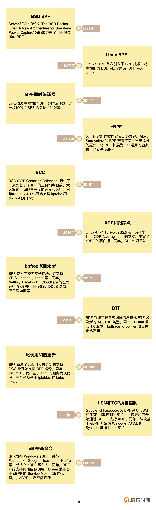

# eBPF 的发展历程及工作原理

## eBPF 的发展历程是什么样的?

在开篇词中，我曾经提到，eBPF 是从 BPF (Berkeley Packet Filter) 技术扩展而来的。而说起 BPF，它的历史就更悠长了。

早在 1992 年的 USENIX 会议上，Steven McCanne 和 Van Jacobson 发布的论文“The BSD Packet Filter: A New Architecture for User-level Packet Capture” 就为 BSD 操作系统带来了革命性的包过滤机制 BSD Packet Filter（简称为 BPF），这比当时最先进的数据包过滤技术还快 20 倍。为什么性能这么好呢？这主要得益于 BPF 的两大设计：
第一，内核态引入一个新的虚拟机，所有指令都在内核虚拟机中运行。
第二，用户态使用 BPF 字节码来定义过滤表达式，然后传递给内核，由内核虚拟机解释执行。这就使得包过滤可以直接在内核中执行，避免了向用户态复制每个数据包，从而极大提升了包过滤的性能，进而被各大操作系统广泛接受。BPF 最初的名字 BSD Packet Filter ，也被作者的工作单位名所替代，变成了 Berkeley Packet Filter（很巧的是，还是简称 BPF）。

eBPF 的诞生是 BPF 技术的一个转折点，使得 BPF 不再仅限于网络栈，而是成为内核的一个顶级子系统。

## eBPF 是怎么工作的?

eBPF 程序并不像常规的线程那样，启动后就一直运行在那里，它需要事件触发后才会执行。这些事件包括系统调用、内核跟踪点、内核函数和用户态函数的调用退出、网络事件，等等。借助于强大的内核态插桩（kprobe）和用户态插桩（uprobe），eBPF 程序几乎可以在内核和应用的任意位置进行插桩。

## eBPF 是万能的吗?

下面是一些最常见的  eBPF 限制：
eBPF 程序必须被验证器校验通过后才能执行，且不能包含无法到达的指令；

eBPF 程序不能随意调用内核函数，只能调用在 API 中定义的辅助函数；

eBPF 程序栈空间最多只有 512 字节，想要更大的存储，就必须要借助映射存储；

在内核 5.2 之前，eBPF 字节码最多只支持 4096 条指令，而 5.2 内核把这个限制提高到了 100 万条；

由于内核的快速变化，在不同版本内核中运行时，需要访问内核数据结构的 eBPF 程序很可能需要调整源码，并重新编译。

## 小结

小结今天，我带你一起探索了 eBPF 技术的发展历程，并梳理了 eBPF 的工作原理。

eBPF 是从 BPF 技术扩展而来的。BPF 出现后，一直都是网络数据包过滤的核心，但直到 eBPF 诞生前，BPF 都仅用于包过滤这个场景中。eBPF 的诞生是 BPF 技术的一个转折点，使它的应用范围逐步从包过滤扩展到内核函数、用户函数、跟踪点、性能事件、安全控制等全新的领域中。而这也进一步催生了 Cilium、Katran、Falco 等一大批基于 eBPF 构建的网络和安全解决方案，形成了繁荣的 eBPF 生态。

eBPF 程序以内核事件触发的方式运行，并且其运行过程包括编译、加载、验证和内核态执行等。为了保护内核的安全和稳定，如果编译后 BPF 字节码中包含了不安全的操作，验证阶段会直接拒绝 BPF 程序的执行。

不过，需要提醒你的是：为了确保安全和稳定，eBPF 程序也有很多的限制，这是你在后续的学习过程中需要特别留心的。

