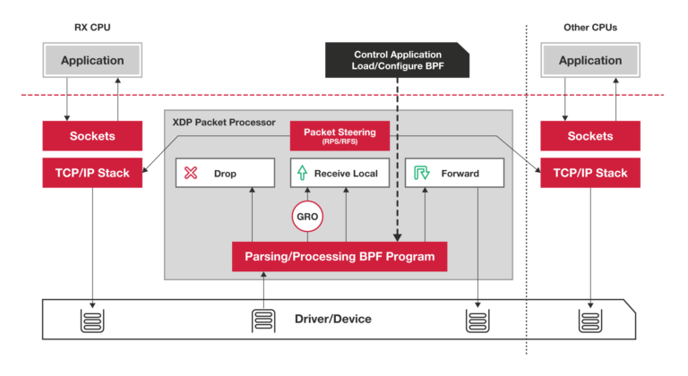
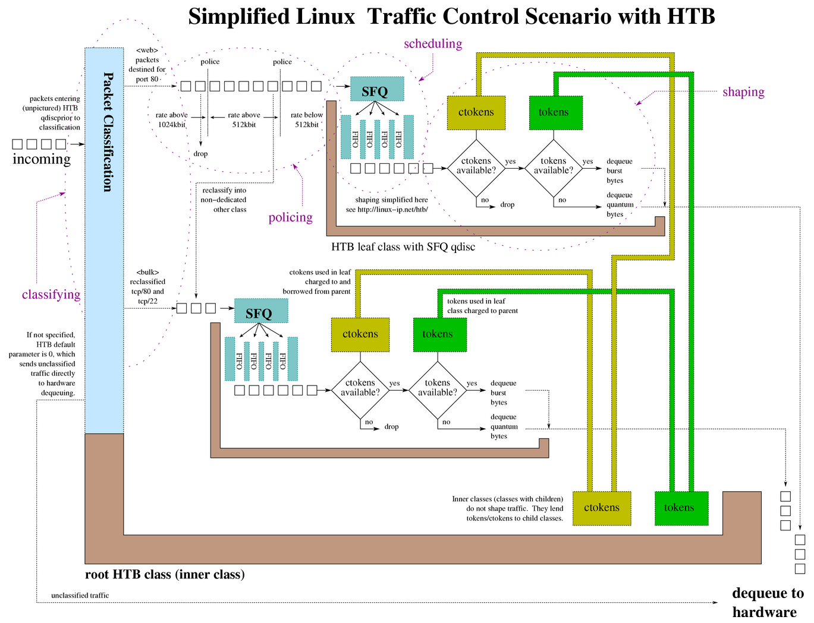
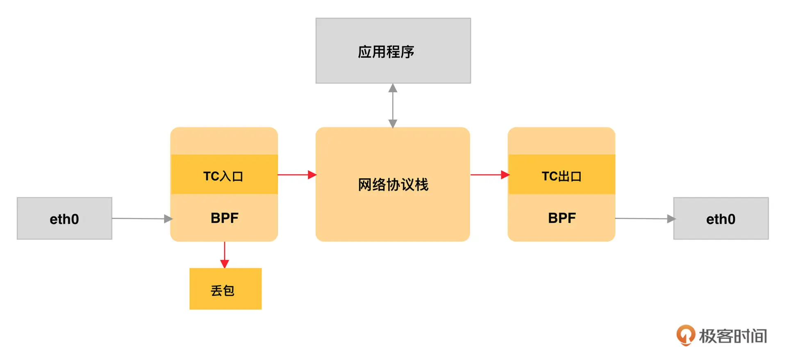
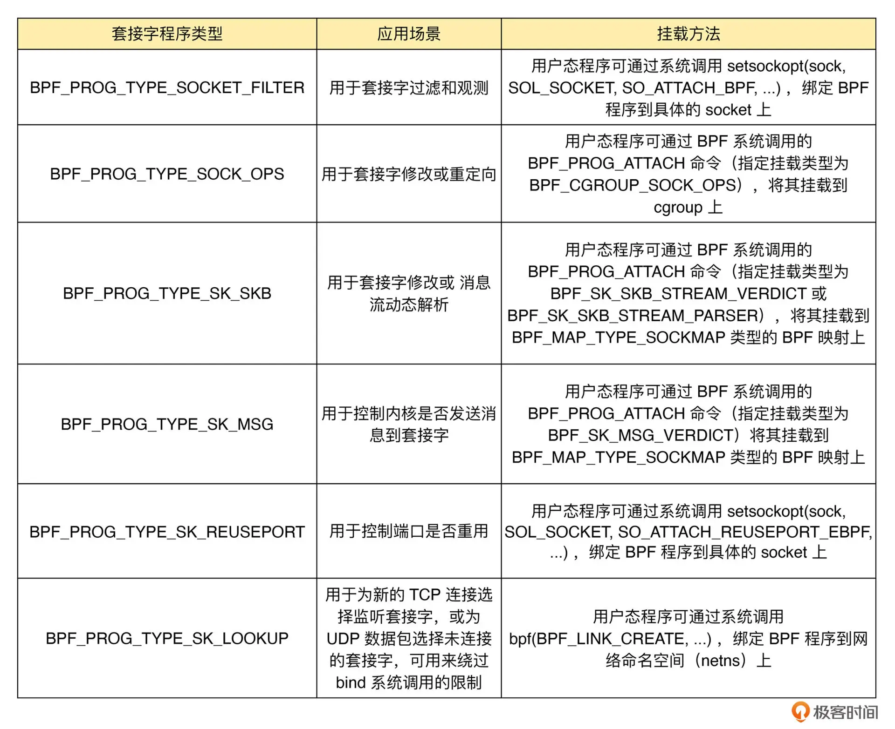
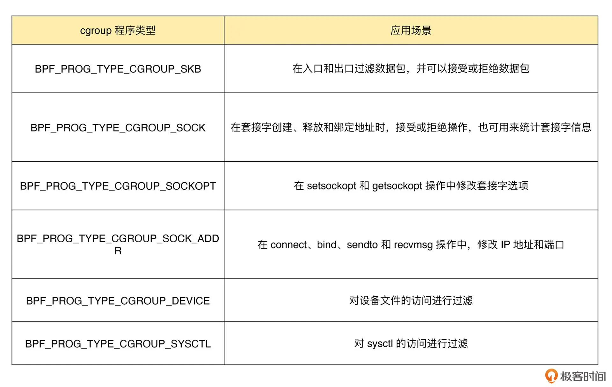
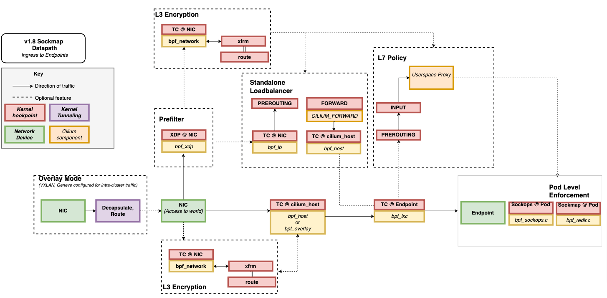

# 各类 eBPF 程序的触发机制及其应用场景

## 流程

一个完整的 eBPF 程序通常包含用户态和内核态两部分：用户态程序通过 BPF 系统调用，完成 eBPF 程序的加载、事件挂载以及映射创建和更新，而内核态中的 eBPF 程序则需要通过 BPF 辅助函数完成所需的任务。

## eBPF 程序可以分成几类？

根据具体功能和应用场景的不同，这些程序类型大致可以划分为三类：

第一类是跟踪，即从内核和程序的运行状态中提取跟踪信息，来了解当前系统正在发生什么。

第二类是网络，即对网络数据包进行过滤和处理，以便了解和控制网络数据包的收发过程。

第三类是除跟踪和网络之外的其他类型，包括安全控制、BPF 扩展等等。

### 跟踪类 eBPF 程序

跟踪类 eBPF 程序主要用于从系统中提取跟踪信息，进而为监控、排错、性能优化等提供数据支撑。比如，我们前几讲中的 Hello World 示例就是一个 BPF_PROG_TYPE_KPROBE 类型的跟踪程序，它的目的是跟踪内核函数是否被某个进程调用了。

这其中，KPROBE、TRACEPOINT 以及 PERF_EVENT 都是最常用的 eBPF 程序类型，大量应用于监控跟踪、性能优化以及调试排错等场景中。我们前几讲中提到的 BCC工具集，其中包含的绝大部分工具也都属于这个类型。

### 网络类 eBPF 程序

网络类 eBPF 程序主要用于对网络数据包进行过滤和处理，进而实现网络的观测、过滤、流量控制以及性能优化等各种丰富的功能。根据事件触发位置的不同，网络类 eBPF 程序又可以分为 XDP（eXpress Data Path，高速数据路径）程序、TC（Traffic Control，流量控制）程序、套接字程序以及 cgroup 程序，下面我们来分别看看。

#### XDP 程序

XDP 程序的类型定义为 BPF_PROG_TYPE_XDP，它在网络驱动程序刚刚收到数据包时触发执行。由于无需通过繁杂的内核网络协议栈，XDP 程序可用来实现高性能的网络处理方案，常用于 DDoS 防御、防火墙、4 层负载均衡等场景。

#### TC 程序

TC 程序的类型定义为 BPF_PROG_TYPE_SCHED_CLS 和 BPF_PROG_TYPE_SCHED_ACT，分别作为 Linux 流量控制 的分类器和执行器。Linux 流量控制通过网卡队列、排队规则、分类器、过滤器以及执行器等，实现了对网络流量的整形调度和带宽控制。

同 XDP 程序相比，TC 程序可以直接获取内核解析后的网络报文数据结构sk_buff（XDP 则是 xdp_buff），并且可在网卡的接收和发送两个方向上执行（XDP 则只能用于接收）。

下面我们来具体看看  TC 程序的执行位置：对于接收的网络包，TC 程序在网卡接收（GRO）之后、协议栈处理（包括 IP 层处理和 iptables 等）之前执行；对于发送的网络包，TC 程序在协议栈处理（包括 IP 层处理和 iptables 等）之后、数据包发送到网卡队列（GSO）之前执行。

除此之外，由于 TC 运行在内核协议栈中，不需要网卡驱动程序做任何改动，因而可以挂载到任意类型的网卡设备（包括容器等使用的虚拟网卡）上。

#### 套接字程序

套接字程序用于过滤、观测或重定向套接字网络包，具体的种类也比较丰富。根据类型的不同，套接字 eBPF 程序可以挂载到套接字（socket）、控制组（cgroup ）以及网络命名空间（netns）等各个位置。你可以根据具体的应用场景，选择一个或组合多个类型的 eBPF 程序，去控制套接字的网络包收发过程。

#### cgroup 程序

cgroup 程序用于对 cgroup 内所有进程的网络过滤、套接字选项以及转发等进行动态控制，它最典型的应用场景是对容器中运行的多个进程进行网络控制。

#### 说明

注意，这几类网络 eBPF 程序是在不同的事件触发时执行的，因此，在实际应用中我们通常可以把多个类型的 eBPF 程序结合起来，一起使用，来实现复杂的网络控制功能。

比如，最流行的 Kubernetes 网络方案 Cilium 就大量使用了 XDP、TC 和套接字 eBPF 程序，如下图（图片来自 Cilium 官方文档，图中黄色部分即为 Cilium eBPF 程序）所示：

#### 其他类 eBPF 程序

除了上面的跟踪和网络 eBPF 程序之外，Linux 内核还支持很多其他的类型。
这些类型的 eBPF 程序虽然不太常用，但在需要的时候也可以帮你解决很多特定的问题。

### 总结

今天，我带你一起梳理了 eBPF 程序的主要类型，以及不同类型 eBPF 程序的应用场景。

根据具体功能和应用场景的不同，我们可以把 eBPF 程序分为跟踪、网络和其他三类：

跟踪类 eBPF 程序主要用于从系统中提取跟踪信息，进而为监控、排错、性能优化等提供数据支撑；

网络类 eBPF 程序主要用于对网络数据包进行过滤和处理，进而实现网络的观测、过滤、流量控制以及性能优化等；

其他类则包含了跟踪和网络之外的其他  eBPF  程序类型，如安全控制、BPF 扩展等。

虽然每个 eBPF 程序都有特定的类型和触发事件，但这并不意味着它们都是完全独立的。通过 BPF 映射提供的状态共享机制，各种不同类型的 eBPF 程序完全可以相互配合，不仅可以绕过单个 eBPF 程序指令数量的限制，还可以实现更为复杂的控制逻辑。

