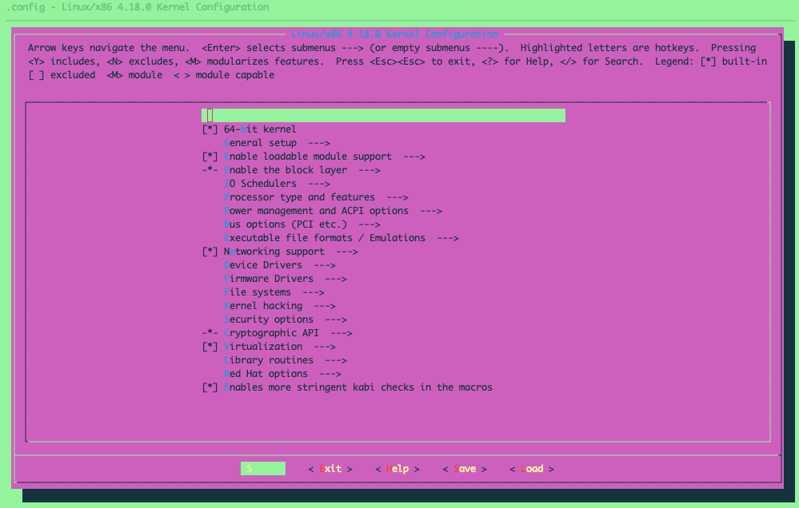
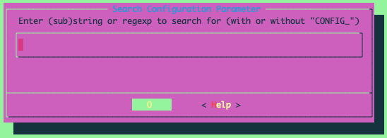
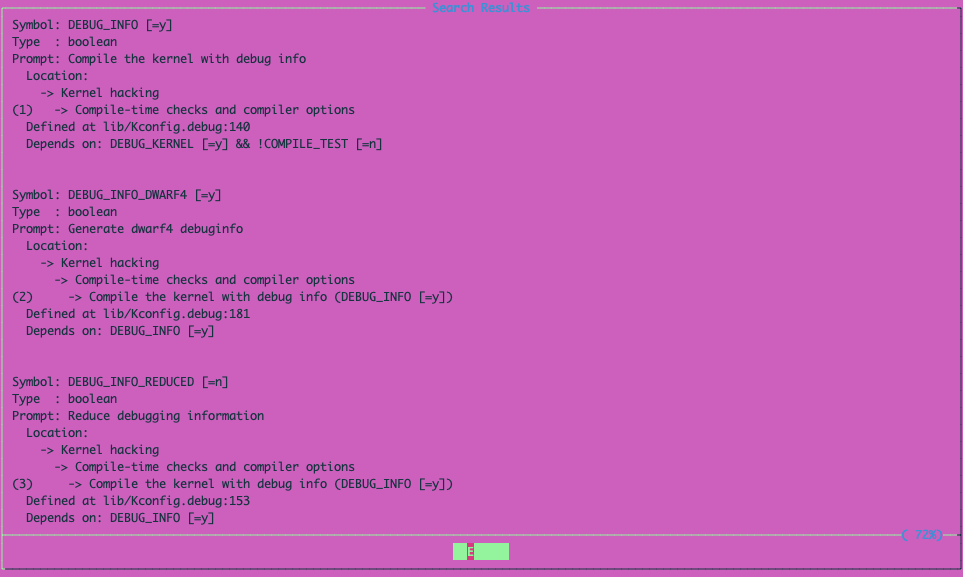
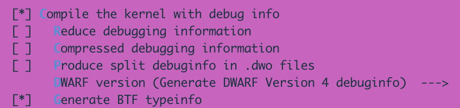

# eBPF 开发环境搭建及内核编译详解

## 关于 eBPF 开发环境搭建的三个典型问题

在 02 讲 中我曾提到，学习 eBPF 技术需要你具备一定的 Linux 操作系统基础，并掌握一些基础知识，包括常见 Linux 操作命令、软件包安装管理方法、C 语言程序的基本语法及编译运行步骤等。

在查看课程的留言和反馈时，我发现很多同学的疑惑是有共性的——这些疑惑正是源于对上面这些基础知识的掌握不够深入。其中，最典型的几个问题如下：

不熟悉 Linux 系统软件包的安装管理方法，比如找不到软件包 linux-head-$(uname -r)，无法定位软件包 libbpf-dev 等。

不熟悉内置软件包版本过老之后的升级方法。比如，在 bpftrace、bpftool 等工具报错之后不知道该如何升级，而对于这两个工具，在很多发行版中都需要先升级到新版本，才可以体验最新的特性。

不熟悉内核的编译和升级方法，比如不清楚内核编译开关的打开方法，不知道如何编译安装内核等。接下来，我就带你一起来看看如何解决这些问题。

## 如何配置 eBPF 开发环境？

在 03 讲 中我曾提到，为了体验最新的 eBPF 特性，推荐你使用自带 5.0 版本以上内核的发行版，并开启 CONFIG_DEBUG_INFO_BTF=y 和 CONFIG_DEBUG_INFO=y 这两个编译选项。而要满足这些条件，最简单的方法就是去公有云，或者借助 Vagrant 等工具，创建一个基于 Ubuntu 20.10、Fedora 31、RHEL 8.2、Debian 11 或者更新版本的虚拟机。

比如，使用 Vagrant 创建并登录 Ubuntu 21.10 虚拟机的步骤如下：


创建Ubuntu 21.10虚拟机:

vagrant init ubuntu/impish64
vagrant up

登录到虚拟机:
vagrant ssh

https://github.com/feiskyer/ebpf-apps#pre-requisites

这样登录虚拟机之后，再根据我们课程中的开发环境配置步骤或者 GitHub 文档来安装依赖包就可以了。不过，在安装依赖包之前，不要忘记先执行一下 sudo apt-get update 等命令，刷新软件包列表，这样就可以避免软件包找不到的问题出现。

当然，你可能会说：最新的发行版和全新的虚拟机虽然很好用，但跟生产环境的差别太大了。比如，很多同学所在的公司还在继续使用着 CentOS、Ubuntu 18.04 等相对较老的系统。如果不使用新版本 Linux 内核引入的新特性，只要内核版本 >=4.9，这些较老的系统其实也是可以稳定运行 eBPF 程序的（各个内核版本中支持的特性可以参考 BCC 文档）。

接下来，我就以 CentOS Stream 和 Ubuntu 18.04 为例，带你一起看看在旧版本的发行版中 eBPF 开发环境的详细配置方法。

CentOS Stream

首先，对于 CentOS 来说，根据官方文档，CentOS 8 已在 2021 年底被放弃，所以不再推荐将其作为生产环境继续使用。对于已有的用户来说，可以升级到 CentOS Stream 或 Rocky Linux 继续获得开源社区的支持。比如，你可以执行下面的命令，把 CentOS 8 升级为 CentOS Stream 8：
```
sudo dnf --disablerepo '*' --enablerepo extras swap centos-linux-repos centos-stream-repos -y
sudo dnf distro-sync -y
```

打开一个终端，SSH 连接到 CentOS Stream 8 系统后，执行 dnf info bcc-tools 查询 BCC 的版本，你会看到如下的输出：

```

Available Packages
Name         : bcc-tools
Version      : 0.19.0
Release      : 5.el8
Architecture : x86_64
Size         : 448 k
Source       : bcc-0.19.0-5.el8.src.rpm
Repository   : appstream
Summary      : Command line tools for BPF Compiler Collection (BCC)
URL          : https://github.com/iovisor/bcc
License      : ASL 2.0
Description  : Command line tools for BPF Compiler Collection (BCC)
```

从输出中你可以发现，它自带的 BCC 版本是 0.19.0，而根据 BCC 的发布列表，其最新的版本已经到了 0.24.0。所以，为了使用较新的 BCC，从源码编译安装就是比直接使用 dnf 安装更好的选择。在终端中执行下面的命令，我们就可以从源码编译和安装 BCC 0.24.0 版本：

```

# 第一步，安装必要的开发工具和开发库
sudo dnf makecache --refresh
sudo dnf groupinstall -y "Development tools"
sudo dnf install -y git bison flex cmake3 clang llvm bpftool elfutils-libelf-devel clang-devel llvm-devel ncurses-devel

# 第二步，从源码编译安装BCC
git clone -b v0.24.0 https://github.com/iovisor/bcc.git
mkdir bcc/build; cd bcc/build
cmake -DENABLE_LLVM_SHARED=1 ..
make
sudo make install
cmake -DPYTHON_CMD=python3 .. # build python3 binding
pushd src/python/
make
sudo make install
popd
```

命令执行成功后，所有的 BCC 工具都会安装到 /usr/share/bcc/tools 目录下。比如，你可以执行 sudo python3 /usr/share/bcc/tools/execsnoop 命令来运行 BCC 自带的 execsnoop 工具。

而对于另外一个常用的 bpftrace 来说，虽然也可以使用源码编译的方式安装，但实际上还有另外一个更简单的方式，那就是从 bpftrace 预先编译好的容器镜像中复制二进制文件。

我们执行下面的命令，安装容器工具 podman 之后，借助 podman 拉取 bpftrace 容器镜像，再将其中的 bpftrace 二进制文件复制出来，就可以把 bpftrace 安装到当前目录了：

```

# 第一步，安装podman
sudo dnf install -y podman

# 第二步，下载镜像后从中复制bpftrace二进制文件
podman pull quay.io/iovisor/bpftrace:master-vanilla_llvm_clang_glibc2.23
podman run --security-opt label=disable -v $(pwd):/output quay.io/iovisor/bpftrace:master-vanilla_llvm_clang_glibc2.23 /bin/bash -c "cp /usr/bin/bpftrace /output"
```

这里需要你留意一点：在上面的命令中，我们使用了 podman 工具来拉取镜像并运行容器，这是因为 CentOS Stream 自带的软件包中不包含 Docker。安装成功后，你可以执行下面的命令验证 bpftrace 的功能：

```

sudo ./bpftrace -e 'tracepoint:syscalls:sys_enter_openat { printf("%s %s\n", comm, str(args->filename)); }'
```

如果一切正常，你将会看到类似下面的输出：

```
Attaching 1 probe...
vmstats /proc/meminfo
vmstats /proc/stat
vminfo /var/run/utmp
...
```

到这里，我们就完成了 CentOS Stream 开发环境的配置。接下来要讲的 Ubuntu 18.04 的安装配置方法也是类似的，只是相应的软件包管理工具要换成 apt 系列工具。

Ubuntu 18.04

首先，对于 BCC 的安装来说，由于 Ubuntu 系统中软件包的名字跟 CentOS 略有不同，所以在第一步安装开发工具和开发库时，我们需要做适当的调整。下面我们来看详细的安装步骤。

第一步，安装必要的开发工具和开发库：

```

# 第一步，安装必要的开发工具和开发库
sudo apt update
sudo apt install -y bison build-essential cmake flex git libedit-dev libllvm6.0 llvm-6.0-dev libclang-6.0-dev python zlib1g-dev libelf-dev libfl-dev python3-distutils linux-tools-$(uname -r)
```

接下来的第二步是从源码编译安装 BCC，步骤跟上面的 CentOS Stream 是一样的，代码如下所示：

```

# 第二步，从源码编译安装BCC
git clone -b v0.24.0 https://github.com/iovisor/bcc.git
mkdir bcc/build; cd bcc/build
cmake -DENABLE_LLVM_SHARED=1 ..
make
sudo make install
cmake -DPYTHON_CMD=python3 .. # build python3 binding
pushd src/python/
make
sudo make install
popd
```


同 CentOS Stream 系统一样，上述命令执行成功后，所有的 BCC 工具也会安装到 /usr/share/bcc/tools 目录下，你可以执行 sudo python3 /usr/share/bcc/tools/execsnoop 命令来验证 BCC 的安装。

BCC 安装成功后，我们再来安装 bpftrace。由于 Ubuntu 已经自带了 Docker 软件包，因此你可以使用 Docker，通过 bpftrace 容器镜像来完成类似 podman 的安装步骤。具体的安装命令如下所示：
```

# 第一步，安装docker
sudo apt install -y docker.io

# 第二步，下载镜像后从中复制bpftrace二进制文件
sudo docker pull quay.io/iovisor/bpftrace:master-vanilla_llvm_clang_glibc2.23
sudo docker run -v $(pwd):/output quay.io/iovisor/bpftrace:master-vanilla_llvm_clang_glibc2.23 /bin/bash -c "cp /usr/bin/bpftrace /output"
```

安装成功后，你可以执行同样的 sudo ./bpftrace -e 'tracepoint:syscalls:sys_enter_openat { printf("%s %s\n", comm, str(args->filename)); }' 命令验证 bpftrace 的功能。

到这里，基本的开发环境就配置好了。不过环境的配置并没有完全结束，在使用 bpftool 时（比如执行命令 sudo bpftool prog dump jited id 2），你很可能会碰到 Error: No libbfd support 的错误。这说明发行版自带的 bpftool 默认不支持 libbfd，这时就需要我们下载内核源码重新编译安装。

那么，该如何下载内核源码，又该如何编译 bpftool 呢？接下来，我就带你一起来看下。

## 如何从内核源码编译升级 bpftool？

从内核源码编译安装 bpftool 的第一步是下载内核的源码。根据发行版的不同，内核源码的下载方法可以分为三种：

利用发行版自带的工具，下载安装发行版提供的内核源码包。比如 RHEL、CentOS、Ubuntu 等，都可以使用这种方法。

直接从内核网站 kernel.org 下载内核源码，注意下载前要先执行 uname -r 查询系统的内核版本。

从发行版提供的代码仓库下载内核源码，比如对于 WSL2，就可以到 GitHub 下载。

后两种方法比较简单，只要从相关的网站中找到链接就可以直接下载了；而对于第一种方法，你可以执行下面的步骤，借助 yumdownloader 或 apt 工具下载发行版提供的内核源码包。

比如，在 CentOS Stream 8 系统中，你可以执行下面的命令，下载内核源码并安装内核编译所需的开发工具和开发库：
```

# 第一步，开启必需的软件包仓库
sudo dnf -y install dnf-plugins-core
sudo dnf config-manager --set-enabled powertools

# 第二步，下载内核源码
yumdownloader --source kernel
rpm -ivh kernel-*.src.rpm

# 第三步，安装依赖包
cd rpmbuild/SPECS/
sudo dnf builddep kernel.spec

# 第四步，解压内核源码并切换到解压后的内核源码目录（注意替换为你的内核版本）
rpmbuild -bp --target=x86_64 kernel.spec
cd ../BUILD/kernel-4.18.0-373.el8/linux-4.18.0-373.el8.x86_64/
```

而在 Ubuntu 18.04 系统中，你则可以执行下面的命令，下载内核源码并安装内核编译所需的开发工具和开发库：
```

# 第一步，下载内核源码
sudo apt install -y linux-source

# 第二步，安装依赖包
sudo apt install build-essential libncurses-dev bison flex libssl-dev libelf-dev dwarves libcap-dev -y

# 第三步，解压并切换到内核源码目录（注意替换为你的内核版本）
tar -jxf /usr/src/linux-source-4.15.0.tar.bz2
cd linux-source-4.15.0/
```

内核源码下载成功后，它的 tools/bpf/bpftool 目录就包含了 bpftool 工具的源代码，因而你就可以从这个目录重新编译和安装 bpftool。

不过在编译之前要注意，libbfd 库包含在 binutils 开发库中，因而你还需要先安装 binutils 开发包。具体的安装和编译步骤如下所示：

```
# 第一步，安装binutils开发库
## CentOS执行dnf命令
sudo dnf install -y binutils-devel
## Ubuntu执行apt命令
sudo apt install -y binutils-dev

# 第二步，从源码编译并安装bpftool
make -C tools/bpf/bpftool
sudo make install -C tools/bpf/bpftool/
```

上述命令执行成功后，再次执行 sudo bpftool prog dump jited id 2 之后，你可以发现，现在已经可以正常看到 eBPF 程序的指令了。

到这里，bpftool 也就升级成功了。接下来，如果当前内核没有开启 CONFIG_DEBUG_INFO 等 eBPF 必需的内核选项，那就还需要进一步开启这些缺少的选项，并重新编译安装内核。

## 如何配置和编译内核？

在更改内核配置之前，由于我们希望保留当前内核的默认选项，而只开启 eBPF 相关的选项，这就需要我们把当前内核的配置选项复制到内核源码目录的 .config 中，即执行下面的复制命令：

```
cp -v /boot/config-$(uname -r) .config
```

接着，继续执行 make menuconfig 就可以进入如下图所示的内核配置选项修改界面：



在这个界面中，输入 / 将进入配置搜索界面：




在搜索框中输入要搜索的配置名 DEBUG_INFO（CONFIG_ 前缀可有可无），然后敲回车，就会进入搜索结果界面，如下图所示：



在搜索结果中，你可以发现：

Symbol 行显示了配置名称以及当前配置值；Type 行显示了配置的数据类型；Prompt 行显示了配置的含义、配置路径、定义位置以及依赖配置。



当配置值需要修改时，我们就可以通过配置路径，按键盘上的方向键找到具体的配置，然后根据界面提示修改。比如，导航到上图提示的“Compile-time checks and comipler options”菜单之后，你就可以找到“Compile the kernel with debug info”选项。如果它还没有开启，按一下键盘上的空格键就可以打开这个配置，如下图所示：

这里提醒下你，通过相同的方法修改完成所有配置之后，不要忘记通过 TAB 键切换到 Save 按钮保存配置。配置更新之后，最后一步就是编译和安装内核了。执行下面的 make 命令，就可以编译并安装内核：

```
# 第一步，多线程编译内核
make -j $(getconf _NPROCESSORS_ONLN)

# 第二步，安装内核模块、内核头文件以及内核二进制文件
sudo make modules_install
sudo make headers_install
sudo make install
```

当新的内核安装成功后，重启系统。恭喜，现在你就可以进入新的内核，然后使用上述步骤中开启的新特性了。

## 总结

今天，我带你一起梳理了 eBPF 开发环境的详细配置方法。如果你没有现成的 Linux 开发机器，那么借助于公有云平台、Windows WSL2、Vagrant 等各种方法，都可以使用最新的发行版创建一个全新的 Linux 虚拟机环境。而对于已有的 Linux 环境来说，我们也可以使用源码编译安装的方法，安装配置 BCC、bpftrace、内核等在内的各种依赖环境。虽然今天的内容适用于还在运行 4.x 版本内核的发行版，我也要提醒你：使用旧版本的内核时，你是没法体验最新的 eBPF 特性的。当你需要体验最新的 eBPF 特性时，不妨考虑配置一个内核较新的发行版作为开发环境，同时在 eBPF 代码中设法兼容旧版本的内核。今天这一讲就到这里了，下一次的动态更新预计会在 6 月份。如果你有对我们课程未来内容的建议，欢迎在评论区提出来，期待你与我一起完善和构建一个最贴近实践的 eBPF 知识体系。

## 思考题


先假设这样一个场景：我们想让 eBPF 跟踪程序可以兼容新旧版本的内核，以便在新版本内核中使用 CO-RE 等新的特性，而在旧版本内核中也可以正常运行。


