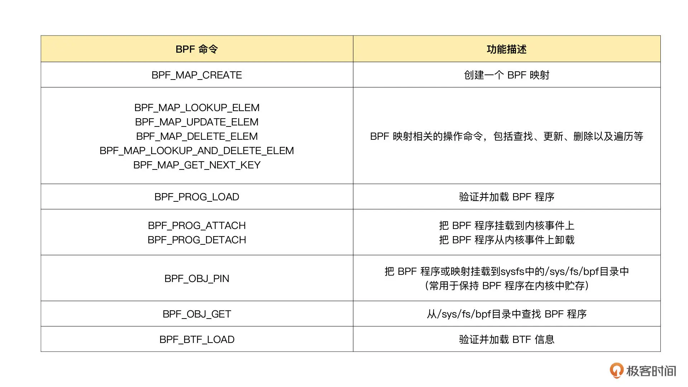
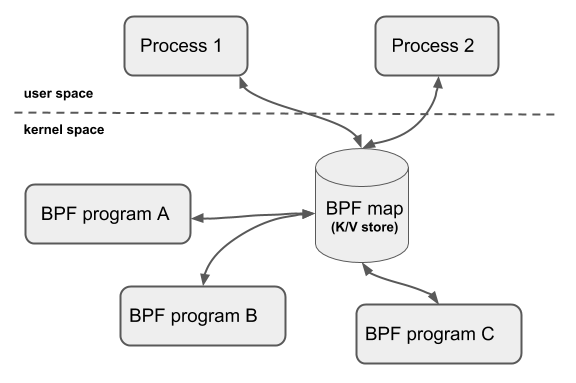

# eBPF 程序是怎么跟内核进行交互的？

## BPF 系统调用

对于用户态程序来说，我想你已经了解，它们与内核进行交互时必须要通过系统调用来完成。而对应到 eBPF 程序中，我们最常用到的就是 bpf 系统调用。

注意，不同版本的内核所支持的 BPF 命令是不同的，具体支持的命令列表可以参考内核头文件 include/uapi/linux/bpf.h 中 bpf_cmd 的定义。比如，v5.13 内核已经支持 36 个 BPF 命令：

## BPF 辅助函数

eBPF 程序并不能随意调用内核函数，因此，内核定义了一系列的辅助函数，用于 eBPF 程序与内核其他模块进行交互。比如，上一讲的 Hello World 示例中使用的 bpf_trace_printk() 就是最常用的一个辅助函数，用于向调试文件系统（/sys/kernel/debug/tracing/trace_pipe）写入调试信息。

## BPF 映射

BPF 映射用于提供大块的键值存储，这些存储可被用户空间程序访问，进而获取 eBPF 程序的运行状态。eBPF 程序最多可以访问 64 个不同的 BPF 映射，并且不同的 eBPF 程序也可以通过相同的 BPF 映射来共享它们的状态。下图（图片来自docs.cilium.io）展示了  BPF 映射的基本使用方法。

## BPF 类型格式 (BTF)

但是，编译时依赖内核头文件也会带来很多问题。主要有这三个方面：首先，在开发 eBPF 程序时，为了获得内核数据结构的定义，就需要引入一大堆的内核头文件；其次，内核头文件的路径和数据结构定义在不同内核版本中很可能不同。因此，你在升级内核版本时，就会遇到找不到头文件和数据结构定义错误的问题；最后，在很多生产环境的机器中，出于安全考虑，并不允许安装内核头文件，这时就无法得到内核数据结构的定义。在程序中重定义数据结构虽然可以暂时解决这个问题，但也很容易把使用着错误数据结构的 eBPF 程序带入新版本内核中运行。

那么，这么多的问题该怎么解决呢？不用担心，BPF 类型格式（BPF Type Format, BTF）的诞生正是为了解决这些问题。从内核 5.2 开始，只要开启了 CONFIG_DEBUG_INFO_BTF，在编译内核时，内核数据结构的定义就会自动内嵌在内核二进制文件 vmlinux 中。并且，你还可以借助下面的命令，把这些数据结构的定义导出到一个头文件中（通常命名为 vmlinux.h）。

## 总结

一个完整的 eBPF 程序，通常包含用户态和内核态两部分：用户态程序需要通过 BPF 系统调用跟内核进行交互，进而完成 eBPF 程序加载、事件挂载以及映射创建和更新等任务；而在内核态中，eBPF 程序也不能任意调用内核函数，而是需要通过 BPF 辅助函数完成所需的任务。尤其是在访问内存地址的时候，必须要借助 bpf_probe_read 系列函数读取内存数据，以确保内存的安全和高效访问。

在 eBPF 程序需要大块存储时，我们还需要根据应用场景，引入特定类型的 BPF 映射，并借助它向用户空间的程序提供运行状态的数据。

这一讲的最后，我还带你一起了解了 BTF 和 CO-RE 项目，它们在提供轻量级调试信息的同时，还解决了跨内核版本的兼容性问题。很多开源社区的 eBPF 项目（如 BCC 等）也都在向 BTF 进行迁移。

