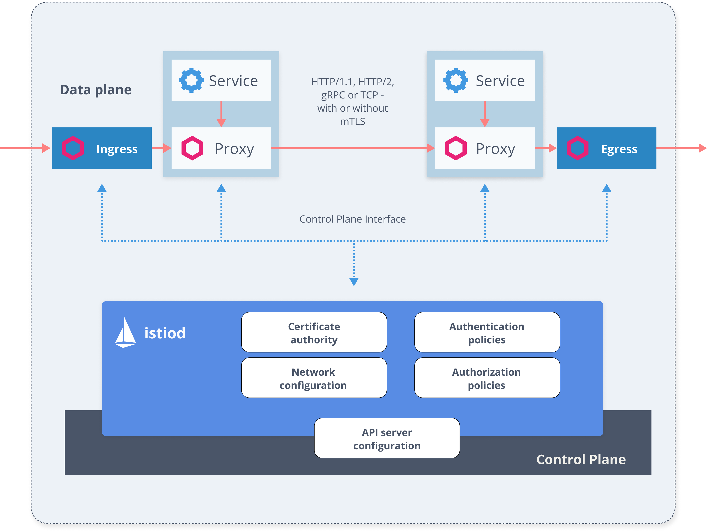
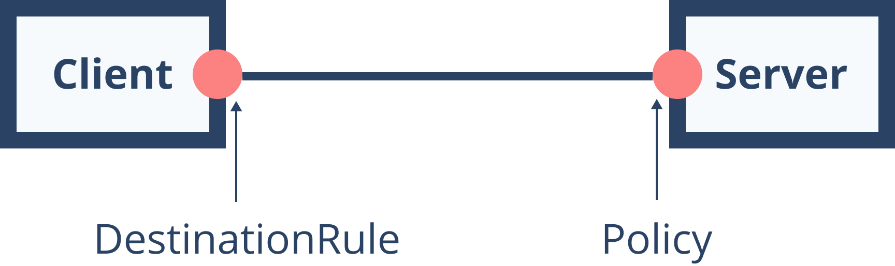

# Istio 服务网格如何处理安全问题？

本文翻译自 https://istio.tetratelabs.io/blog/istio-security/

在这篇博客中，将解释 Istio 如何帮助解决诸如流量加密、提供灵活的服务访问控制、配置双向 TLS 和细粒度访问策略与审计等问题。

## Istio 安全架构

Istio 以下组件提供安全功能，主要涉及：

用于管理密钥和证书的证书颁发机构 (CA)

Sidecar 和外部代理：实现客户端和服务器之间的安全通信（它们用作策略执行点 (PEP)）

Envoy 代理扩展：管理遥测和审计

配置 API 服务器：分发身份验证、授权策略和安全命名信息

策略执行点 (PEP) 是充当资源看门人的组件。

让我们看一下下图中不同组件及其职责的架构图。



## 验证

根据定义，身份验证是验证用户或进程的身份的过程或动作。意味着 Istio 需要从请求中提取凭证并证明它们是真实的。
Istio 中的 Envoy 代理在相互通信时使用证书作为其凭证。这些证书与 Kubernetes 中的服务帐户相关联。

当两个服务开始通信时，它们需要用身份信息交换凭证以相互验证对方。
客户端根据安全命名信息检查服务器的身份，以查看它是否是服务的授权运行者。
在服务器端，服务器根据授权策略确定客户端可以访问哪些信息。
此外，服务器可以审核谁在什么时间访问了什么，并决定是批准还是拒绝客户端对服务器的调用。
安全命名信息包含从服务标识到服务名称的映射。服务器身份编码在证书中，服务名称是发现服务或 DNS 使用的名称。
从身份 A 到服务名称 B 的单个映射意味着“A 是允许和授权的服务 B”。 
Pilot 生成安全命名信息，然后分发给所有 Sidecar Envoy。

## 身份

对于发布身份，Istio 使用适用于所有人的安全的生产级别身份框架 SPIFFE（发音为 spiffy）。 
SPIFFE 是可以引导和发布身份的框架的规范。

Citadel 实现了 SPIFFE 规范；SPIFFE 的另一种实现称为 SPIRE（SPIFFE 运行时框架）。

SPIFFE 标准包含三个概念：

SPIFFE ID：定义服务如何识别自己的身份命名空间

SPIFFE 可验证身份证明文件 (SVID)：规定如何呈现和验证已发布的身份。它对 SPIFFE ID 进行编码。

工作负载 API：指定用于发布或检索另一个工作负载 SVID 的工作负载的 API

在 Kubernetes 中，服务帐户用于服务身份。表示 SPIFFE ID 的 URI 的格式如下：spiffe://cluster-name/ns/namespace/sa/service-account-name。默认情况下，任何未明确设置服务帐户的 pod 都将使用部署在命名空间中的默认服务帐户。

可以这样查看服务帐户和相应的 secret：

```
$ kubectl describe sa default
Name:                default
Namespace:           default
Labels:              <none>
Annotations:         <none>
Image pull secrets:  <none>
Mountable secrets:   default-token-pjqr9
Tokens:              default-token-pjqr9
Events:              <none>
```

可挂载的 secret/token 名称是包含证书和令牌的同一命名空间中的 secret 名称。

```
$ kubectl describe secret default-token-pjqr9

Name:         default-token-pjqr9
Namespace:    default
Labels:       <none>
Annotations:  kubernetes.io/service-account.name: default
              kubernetes.io/service-account.uid: fe107ed9-8707-11e9-9803-025000000001

Type:  kubernetes.io/service-account-token

Data
====
ca.crt:     1025 bytes
namespace:  7 bytes
token:      ey....
```

因此，默认服务帐户的 SPIFFE ID 将编码如下：spiffe://cluster.local/ns/default/sa/default。
该规范还描述了如何将此身份编码为可用于证明身份的证书。SPIFFE 表示身份（URI）需要在证书的主题备用名称（SAN）中进行编码。
最后，Istio 中用于发布和检索 SVID 的工作负载 API 是使用 ACME（自动证书管理环境）协议实现的。

Citadel 组件自动为现有和新的服务帐户创建证书，然后将它们存储为 Kubernetes Secret。
如果创建部署并查看 pod 规范，会注意到如下内容：

```
...
 volumeMounts:
    - mountPath: /var/run/secrets/kubernetes.io/serviceaccount
      name: default-token-pjqr9
      readOnly: true
...
```

使用此代码段，Kubernetes 将证书和其他信息从服务帐户安装到 pod。

出于安全目的，颁发的证书是短暂的（即使攻击者可以获得 SVID，他们也只能在短时间内使用它），Citadel 确保证书自动轮换。

## 双向 TLS 身份验证

传输身份验证，也称为服务到服务身份验证，是 Istio 支持的身份验证类型之一。
Istio 实现双向 TLS 作为传输身份验证的解决方案。

TLS 代表传输层安全性。每次尝试访问安全端点时都会使用 TLS。例如，通过 HTTPS 访问 https://learnistio.com 会利用 TLS 来保护运行网站的服务器与使用的浏览器之间的通信。传输敏感信息或私人信息甚至都无关紧要 - 无论如何，连接都是安全的。

使用 TLS 需要证书颁发机构 (CA) 向服务器颁发数字证书，然后该服务器将其交给浏览器以通过 CA 进行验证。

mTLS 采用相同的想法，但将其应用于应用程序或服务。这意味着客户端不仅验证服务器的证书，还验证客户端的证书。

TLS 的一个例子是越过边境，需要向海关官员出示护照（证书）。海关官员确保护照有效、未过期等。在 mTLS 的情况下，还需要向海关官员索取护照，然后进行验证。

一旦双方通过各自的 CA 验证了证书，双方之间的通信就可以安全地进行。

对于 Istio，服务之间的所有通信都通过 Envoy 代理。以下是从服务 A 向服务 B 进行调用时发生的步骤：

1. 流量从服务 A 路由到同一个 pod 中的 Envoy 代理

2. 服务 A 代理启动与服务 B 代理的 mTLS 握手（也会进行安全命名检查）

3. mTLS 连接建立

4. 流量被转发到服务 B 代理

5. 服务 B 代理将流量转发到同一个 pod 中的服务 B

Istio 中的 Mutual TLS 支持一种许可模式。
此模式允许服务同时接受纯文本流量和 mTLS 流量。
这可以帮助我们逐步将服务迁移到 mTLS，而不会破坏现有的纯文本流量。
一旦所有服务都拥有代理，就可以改为配置 mTLS 唯一模式。

要在服务之间配置 mTLS，使用目标规则 (DestinationRule) 中的流量策略字段。
例如，要求客户端在与 service-b 通信时使用 mTLS，可以使用 ISTIO_MUTUAL 模式：

```
apiVersion: networking.istio.io/v1alpha3
kind: DestinationRule
metadata:
  name: service-b-istio-mtls
spec:
  host: service-b.default.svc.cluster.local
  trafficPolicy:
    tls:
      mode: ISTIO_MUTUAL
```

还可以提供自己的证书并将模式设置为 MUTUAL，如下所示：

```
apiVersion: networking.istio.io/v1alpha3
kind: DestinationRule
metadata:
  name: service-b-mtls
spec:
  host: service-b.default.svc.cluster.local
  trafficPolicy:
    tls:
      mode: MUTUAL
      clientCertificate: /etc/certs/cert.pem
      privateKey: /etc/certs/pkey.pem
      caCertificates: /etc/certs/cacerts.pem
```

最后，还可以将 mode 字段设置为 SIMPLE 以便客户端配置使用 TLS：

```
apiVersion: networking.istio.io/v1alpha3
kind: DestinationRule
metadata:
  name: service-b-tls
spec:
  host: service-b.default.svc.cluster.local
  trafficPolicy:
    tls:
      mode: SIMPLE
```

## 原始认证

原始身份验证，称为最终用户身份验证，用于验证作为最终用户或设备请求的原始客户端。
Istio 通过 JSON Web Token (JWT) 验证和开源 OpenID 连接提供程序（例如 Googe Auth、Auth0 或 Firebase Auth）启用原始身份验证。

在原始身份验证 (JWT) 的情况下，应用程序本身负责获取 JWT 令牌并将其附加到请求中。

## 身份验证策略

身份验证策略用于指定网格内服务的身份验证要求。
同样，与流量路由一样，Pilot 监视策略资源的变化，然后将配置转换并推送到 Envoy 代理。

这些策略定义了可以接受的身份验证方法（即接收的请求）。
而对于传出请求，可以将使用本博客前面所述的目标规则。下图说明了这一点：



可以在接下来解释的两个范围内定义身份验证策略。

### 命名空间范围的策略

命名空间范围内的策略只能影响在同一命名空间中运行的服务。 
此外，需要指定命名空间名称，否则将使用默认命名空间。下面是 prod 命名空间的命名空间策略示例：

```
apiVersion: security.istio.io/v1beta1
kind: PeerAuthentication
metadata:
  name: default
spec:
  mtls:
    mode: STRICT
```

### 网格范围的策略

网格范围的策略可以应用于网格中的所有服务。
只能定义一个名为 default 和一个空目标部分的网格范围策略。
与命名空间范围策略的一个区别是资源名称。
命名空间范围的策略资源称为“Policy”，而网格范围的策略资源称为“MeshPolicy”。

## 目标选择器

为了定义受策略影响的服务，使用了目标选择器。 
目标选择器是应用策略的选定服务的规则列表。 
如果未提供目标选择器，则该策略将用于同一命名空间中的所有服务。

例如，下面的命名空间范围策略将应用于端口 8080 上的服务 a（无论端口）和服务 b：

```
apiVersion: authentication.istio.io/v1alpha1
kind: PeerAuthentication
metadata:
  name: sample-policy
  namespace: prod
spec:
  target:
  - name: service-a
  - name: service-b
    ports:
    - number: 8080
```

存在多个策略的情况下，它们从最窄的匹配策略（例如特定服务）到命名空间和网格范围内进行评估。 
如果多个策略适用于一项服务，则随机选择一个。

## 传输认证

名为 peers 的字段定义了身份验证方法和该方法的任何参数。 
在撰写本文时，唯一受支持的身份验证方法是 mTLS。 
要启用它，使用 mtls 键（使用前面的示例）：

```
apiVersion: authentication.istio.io/v1alpha1
kind: PeerAuthentication
metadata:
  name: sample-policy
  namespace: prod
spec:
  target:
  - name: service-a
  - name: service-b
    ports:
    - number: 8080
  peers:
    - mtls:
...
```

## 原始认证

目前 Istio 支持的唯一来源身份验证是 JWT。
使用 origins 字段，可以定义方法和参数，例如允许的 JWT 颁发者以及启用或禁用特定路径的 JWT 身份验证。 
这是一个示例片段，展示了如何定义接受 Google 发布的 JWT 的原始身份验证。
此外，我们从 JWT 身份验证中排除 /health 路径：

```
origins:
- jwt:
    issuer: https://accounts.google.com
    jwksUri: https://www.googleapis.com/oauth2/v3/certs
    trigger_rules:
    - excluded_paths:
      - exact: /health
```

## 授权

授权功能可用于启用对网格中工作负载的访问控制。
该策略支持 ALLOW 和 DENY 策略。
如果同时使用允许和拒绝策略，则首先评估拒绝策略。
每个 Envoy 代理都使用一个授权引擎，该引擎在运行时决定是允许还是拒绝请求。

当请求到达代理时，授权引擎评估请求并返回授权结果 - 允许或拒绝。策略按以下顺序进行评估：

1. 如果任何 DENY 策略与请求匹配 → 拒绝请求

2. 如果工作负载没有 ALLOW 策略 → 允许请求

3. 如果任何 ALLOW 策略与请求匹配 → 允许请求

4. 拒绝请求

无需单独启用任何授权功能。
为工作负载创建和应用授权策略就足够了。
默认情况下，如果没有定义授权策略，则不会强制执行访问控制并允许所有请求。

授权策略是使用 AuthorizationPolicy 资源配置的。
此资源包括选择器（目标工作负载）、操作（允许或拒绝）和指定何时触发操作的规则列表。

例如，通过下面的代码片段，可以将授权策略应用于任何设置了标签 app=greeter-service 和 version=v2 的工作负载。
一旦请求到达工作负载的 Envoy 代理，授权引擎就会检查流量是否来自具有提供的服务帐户 (helloweb) 的主体，以及操作是否是 GET 并且 x-user 标头设置为 user-1。如果所有这些都满足，则允许请求，否则，请求被拒绝。

```
apiVersion: security.istio.io/v1beta1
kind: AuthorizationPolicy
metadata:
 name: greeter-service
 namespace: default
spec:
 action: ALLOW
 selector:
   matchLabels:
     app: greeter-service
     version: v2
 rules:
 - from:
   - source:
       principals: ["cluster.local/ns/default/sa/helloweb"]
   to:
   - operation:
       methods: ["GET"]
   when:
   - key: request.headers[x-user]
     values: ["user-1"]
```

我们专门将授权策略应用于标记为 app: greeter-service 和 version: v2 的工作负载。
如果我们想将策略应用于默认命名空间中的所有工作负载，我们可以简单地省略选择器字段，如下所示：

```
apiVersion: security.istio.io/v1beta1
kind: AuthorizationPolicy
metadata:
 name: greeter-service
 namespace: default
spec:
 rules:
 - from:
   - source:
       principals: ["cluster.local/ns/default/sa/helloweb"]
   to:
   - operation:
       methods: ["GET"]
   when:
   - key: request.headers[x-user]
     values: ["user-1"]
```

还可以定义适用于服务网格中所有工作负载的授权策略，无论命名空间如何。
为此，需要在根命名空间中创建一个 AuthorizationPolicy。 
默认情况下，根命名空间是 istio-system。如果需要更改它，则必须更新 MeshConfig 中的 rootNamespace 字段。

