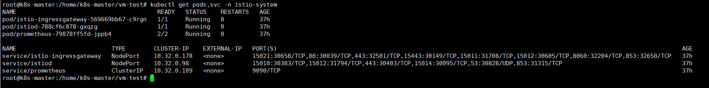
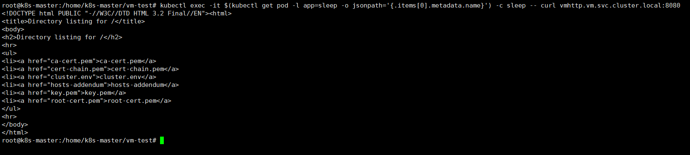
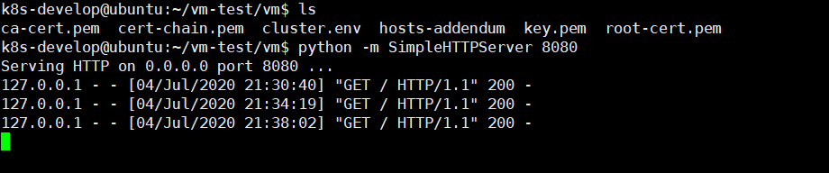
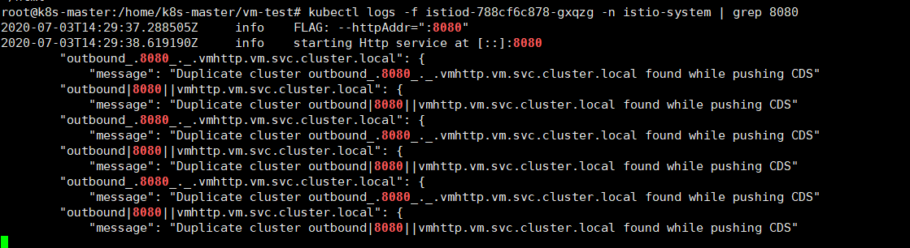
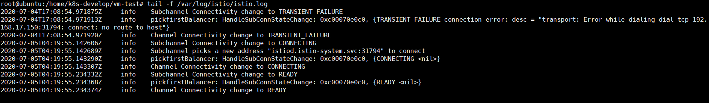

# istio 集群服务与 VM (虚拟机)服务进行 Mesh 通信

使用 istio ingress-gateway 将 VM 或裸机主机集成到部署在 Kubernetes 上的 Istio Mesh 中.

## 前提条件

Kubernetes 集群 + Istio 集群 + VM

kubectl get nodes

```
NAME         STATUS   ROLES    AGE   VERSION
k8s-master   Ready    master   42d   v1.17.0
k8s-node01   Ready    <none>   42d   v1.17.0
k8s-node02   Ready    <none>   42d   v1.17.0
```

kubectl version

```
Client Version: version.Info{Major:"1", Minor:"17", GitVersion:"v1.17.0", GitCommit:"70132b0f130acc0bed193d9ba59dd186f0e634cf", GitTreeState:"clean", BuildDate:"2019-12-07T21:20:10Z", GoVersion:"go1.13.4", Compiler:"gc", Platform:"linux/amd64"}
Server Version: version.Info{Major:"1", Minor:"17", GitVersion:"v1.17.0", GitCommit:"70132b0f130acc0bed193d9ba59dd186f0e634cf", GitTreeState:"clean", BuildDate:"2019-12-07T21:12:17Z", GoVersion:"go1.13.4", Compiler:"gc", Platform:"linux/amd64"}
```

kubectl get svc,pods -n istio-system

```
NAME                           TYPE        CLUSTER-IP    EXTERNAL-IP   PORT(S)                                                                                                                   AGE
service/istio-ingressgateway   NodePort    10.32.0.178   <none>        15021:30658/TCP,80:30039/TCP,443:32501/TCP,15443:30149/TCP,15011:31708/TCP,15012:30605/TCP,8060:32204/TCP,853:32658/TCP   37h
service/istiod                 NodePort    10.32.0.98    <none>        15010:30383/TCP,15012:31794/TCP,443:30403/TCP,15014:30095/TCP,53:30828/UDP,853:31315/TCP                                  37h
service/prometheus             ClusterIP   10.32.0.109   <none>        9090/TCP                                                                                                                  37h

NAME                                        READY   STATUS    RESTARTS   AGE
pod/istio-ingressgateway-569669bb67-c9rgn   1/1     Running   0          37h
pod/istiod-788cf6c878-gxqzg                 1/1     Running   0          37h
pod/prometheus-79878ff5fd-jppb4             2/2     Running   0          37h
```

istioctl version

```
client version: 1.6.0
control plane version: 1.6.0
data plane version: 1.6.0 (3 proxies)
```

## 测试步骤

1. 在 /home/k8s-master/vm-test 目录下载 Istio 1.6.0 release 包.

1. curl -L https://istio.io/downloadIstio | ISTIO_VERSION=1.6.0 sh -

1. 设置 istioctl 到环境变量中. 

    cd istio-1.6.0 && export PATH=$PWD/bin:$PATH

1. 设置测试步骤所需的环境变量
    
    ```
    ISTIO_DIR="/home/k8s-master/vm-test/istio-1.6.0"
    CLUSTER_NAME="cluster150"
    SERVICE_NAMESPACE="vm"
    WORK_DIR="/home/k8s-master/vm-test/cluster-vm"
    ```
   
1. 创建工作目录

     mkdir -p "${WORK_DIR}"/"${CLUSTER_NAME}"/"${SERVICE_NAMESPACE}"
     
1. 创建用于虚拟机和 Istio 控制平面通信认证的证书

    cd "${WORK_DIR}"
    
    make -f "${ISTIO_DIR}"/samples/certs/Makefile NAME="${CLUSTER_NAME}" NAMESPACE="${SERVICE_NAMESPACE}" "${CLUSTER_NAME}"-certs-wl
    
    Istio 1.6.0 GitHub 源码库中不存在这个 Makefile 文件，branch 1.6.0 没有这个文件，tag 1.6.0 中存在这个文件
    
    注意：Istio 1.6.0 以上，使用 make -f "${ISTIO_DIR}"/tools/certs/Makefile NAME="${CLUSTER_NAME}" NAMESPACE="${SERVICE_NAMESPACE}" "${CLUSTER_NAME}"-certs-wl

1. 在集群中注册所需的 secret

    ```
    kubectl create namespace istio-system
    kubectl create secret generic cacerts -n istio-system \
        --from-file="${WORK_DIR}"/"${CLUSTER_NAME}"/ca-cert.pem \
        --from-file="${WORK_DIR}"/"${CLUSTER_NAME}"/ca-key.pem \
        --from-file="${WORK_DIR}"/"${CLUSTER_NAME}"/root-cert.pem \
        --from-file="${WORK_DIR}"/"${CLUSTER_NAME}"/cert-chain.pem
    ``` 
   
1. 创建安装 istio 集群 yaml 文件
    
    ```
    cat <<EOF> "${WORK_DIR}"/vmintegration.yaml
    apiVersion: install.istio.io/v1alpha1
    metadata:
      namespace: istio-system
      name: example-istiocontrolplane
    kind: IstioOperator
    spec:
      values:
        global:
          meshExpansion:
            enabled: true
    EOF
   ```

1. 安装 istio 集群

    istioctl install -f "${WORK_DIR}"/vmintegration.yaml

1. 集群安装成功后, 编辑 istiod, istio-ingressgateway svc type 类型为 NodePort

    kubectl edit svc istiod -n istio-system 更换 type: NodePort
    
    kubectl edit svc istio-ingressgateway -n istio-system 更换 type: NodePort

    

1. 准备复制到 VM 机器的文件
    
    ```
    cp -a "${WORK_DIR}"/"${CLUSTER_NAME}"/ca-cert.pem "${WORK_DIR}"/"${CLUSTER_NAME}"/"${SERVICE_NAMESPACE}"/
    cp -a "${WORK_DIR}"/"${CLUSTER_NAME}"/key.pem "${WORK_DIR}"/"${CLUSTER_NAME}"/"${SERVICE_NAMESPACE}"/
    cp -a "${WORK_DIR}"/"${CLUSTER_NAME}"/root-cert.pem "${WORK_DIR}"/"${CLUSTER_NAME}"/"${SERVICE_NAMESPACE}"/
    cp -a "${WORK_DIR}"/"${CLUSTER_NAME}"/workload-cert-chain.pem "${WORK_DIR}"/"${CLUSTER_NAME}"/"${SERVICE_NAMESPACE}"/cert-chain.pem
    ```
   
1. 准备 cluster.env 文件

    ```
    ISTIO_SERVICE_CIDR=$(echo '{"apiVersion":"v1","kind":"Service","metadata":{"name":"tst"},"spec":{"clusterIP":"1.1.1.1","ports":[{"port":443}]}}' | kubectl apply -f - 2>&1 | sed 's/.*valid IPs is //')
    touch "${WORK_DIR}"/"${CLUSTER_NAME}"/"${SERVICE_NAMESPACE}"/cluster.env
    echo ISTIO_SERVICE_CIDR=$ISTIO_SERVICE_CIDR > "${WORK_DIR}"/"${CLUSTER_NAME}"/"${SERVICE_NAMESPACE}"/cluster.env
    echo "ISTIO_INBOUND_PORTS=3306,8080" >> "${WORK_DIR}"/"${CLUSTER_NAME}"/"${SERVICE_NAMESPACE}"/cluster.env
    ``` 
   
    ```
    NAME                           TYPE        CLUSTER-IP    EXTERNAL-IP   PORT(S)                                                                                                                   AGE
    service/istio-ingressgateway   NodePort    10.32.0.178   <none>        15021:30658/TCP,80:30039/TCP,443:32501/TCP,15443:30149/TCP,15011:31708/TCP,15012:30605/TCP,8060:32204/TCP,853:32658/TCP   37h
    service/istiod                 NodePort    10.32.0.98    <none>        15010:30383/TCP,15012:31794/TCP,443:30403/TCP,15014:30095/TCP,53:30828/UDP,853:31315/TCP                                  37h
    service/prometheus             ClusterIP   10.32.0.109   <none>        9090/TCP
    ``` 
    
    ISTIO_PILOT_PORT 对应于 svc istiod 中的 15012:31794 ISTIO_PILOT_PORT 在这里是 31794
    echo ISTIO_PILOT_PORT=31794 >> "${WORK_DIR}"/"${CLUSTER_NAME}"/"${SERVICE_NAMESPACE}"/cluster.env
    
1. 创建 vm 所需的 hosts 文件
    
    ```
    192.168.140.150 是主机的 IP 地址
    touch "${WORK_DIR}"/"${CLUSTER_NAME}"/"${SERVICE_NAMESPACE}"/hosts-addendum
    echo "192.168.140.150 istiod.istio-system.svc" > "${WORK_DIR}"/"${CLUSTER_NAME}"/"${SERVICE_NAMESPACE}"/hosts-addendum
    ```

1. 复制必要的文件到 VM 机器

    ```
    scp -r "${WORK_DIR}"/"${CLUSTER_NAME}"/"${SERVICE_NAMESPACE}" k8s-develop@192.168.17.140:/home/k8s-develop/vm-test
    ```
   
1. 在 VM 执行以下操作
    
    在 /home/k8s-develop/vm-test 目录下执行以下操作：
    
    ```
    sudo apt -y update
    sudo apt -y upgrade
    curl -LO https://storage.googleapis.com/istio-release/releases/1.6.0/deb/istio-sidecar.deb
    sudo dpkg -i istio-sidecar.deb
    sudo mkdir -p /etc/certs
    sudo cp {root-cert.pem,cert-chain.pem,key.pem} /etc/certs
    sudo cp cluster.env /var/lib/istio/envoy
    sudo sh -c 'cat hosts-addendum >> /etc/hosts'
    sudo chown -R istio-proxy /etc/certs /var/lib/istio/envoy
    sudo systemctl start istio
    ```
    其中 
    ```
    root@ubuntu:/home/k8s-develop/vm-test# cat vm/cluster.env 
    ISTIO_SERVICE_CIDR=10.32.0.0/24
    ISTIO_INBOUND_PORTS=3306,8080
    ISTIO_PILOT_PORT=31794
    ```
   
    ```
    root@ubuntu:/home/k8s-develop/vm-test# cat /etc/hosts
    127.0.0.1	localhost
    127.0.1.1	ubuntu
    
    # The following lines are desirable for IPv6 capable hosts
    ::1     ip6-localhost ip6-loopback
    fe00::0 ip6-localnet
    ff00::0 ip6-mcastprefix
    ff02::1 ip6-allnodes
    ff02::2 ip6-allrouters
    192.168.17.150 istiod.istio-system.svc
    ```
   
    ```
    root@ubuntu:/home/k8s-develop/vm-test# sudo systemctl status istio
    ● istio.service - istio-sidecar: The Istio sidecar
       Loaded: loaded (/lib/systemd/system/istio.service; disabled; vendor preset: enabled)
       Active: active (running) since Fri 2020-07-03 07:37:01 PDT; 1 day 13h ago
         Docs: http://istio.io/
     Main PID: 56788 (su)
        Tasks: 0 (limit: 4632)
       CGroup: /system.slice/istio.service
               ‣ 56788 su -s /bin/bash -c INSTANCE_IP=192.168.17.140 POD_NAME=ubuntu POD_NAMESPACE=default exec /usr/local/bin/pilot-agent proxy  2> /var/log/istio/istio.err.
    
    Jul 03 07:37:01 ubuntu istio-start.sh[56788]: -A ISTIO_OUTPUT -m owner --gid-owner 0 -j RETURN
    Jul 03 07:37:01 ubuntu istio-start.sh[56788]: -A ISTIO_OUTPUT -d 127.0.0.1/32 -j RETURN
    Jul 03 07:37:01 ubuntu istio-start.sh[56788]: -A ISTIO_OUTPUT -d 10.32.0.0/24 -j ISTIO_REDIRECT
    Jul 03 07:37:01 ubuntu istio-start.sh[56788]: -A ISTIO_OUTPUT -j RETURN
    Jul 03 07:37:01 ubuntu istio-start.sh[56788]: -A ISTIO_REDIRECT -p tcp -j REDIRECT --to-ports 15001
    Jul 03 07:37:01 ubuntu istio-start.sh[56788]: COMMIT
    Jul 03 07:37:01 ubuntu istio-start.sh[56788]: # Completed on Fri Jul  3 07:37:01 2020
    Jul 03 07:37:01 ubuntu su[56788]: Successful su for istio-proxy by root
    Jul 03 07:37:01 ubuntu su[56788]: + ??? root:istio-proxy
    Jul 03 07:37:01 ubuntu su[56788]: pam_unix(su:session): session opened for user istio-proxy by (uid=0)
    ```

1. 在 VM 执行以下命令，启动一个服务
    
    python -m SimpleHTTPServer 8080
    
    ```
    k8s-develop@ubuntu:~/vm-test/vm$ ls
    ca-cert.pem  cert-chain.pem  cluster.env  hosts-addendum  key.pem  root-cert.pem
    k8s-develop@ubuntu:~/vm-test/vm$ python -m SimpleHTTPServer 8080
    Serving HTTP on 0.0.0.0 port 8080 ...
    ```

1. 在 istio 集群中添加 vm 刚刚启动的服务

    istioctl experimental add-to-mesh external-service vmhttp ${VM_IP} http:8080 -n ${SERVICE_NAMESPACE}
    
    istioctl experimental add-to-mesh external-service vmhttp 192.168.17.140 http:8080 -n vm
    
    ```
    root@k8s-master:/home/k8s-master/vm-test# kubectl get se,svc -n vm
    NAME                                                     HOSTS                           LOCATION        RESOLUTION   AGE
    serviceentry.networking.istio.io/mesh-expansion-vmhttp   [vmhttp.vm.svc.cluster.local]   MESH_INTERNAL   STATIC       37h
    
    NAME             TYPE        CLUSTER-IP    EXTERNAL-IP   PORT(S)    AGE
    service/vmhttp   ClusterIP   10.32.0.157   <none>        8080/TCP   37h
    ```
    
1. 在 istio 集群中启动 sleep 示例服务

    kubectl apply -f samples/sleep/sleep.yaml
    
    kubectl exec -it $(kubectl get pod -l app=sleep -o jsonpath='{.items[0].metadata.name}') -c sleep -- curl vmhttp.vm.svc.cluster.local:8080
    
    ```
    sleep-f8cbf5b76-w8vd8root@k8s-master:/home/k8s-master/vm-test# kubectl exec -it $(kubectl get pod -l app=sleep -o jsonpath='{.items[0].metadata.name}') -c sleep -- curl vmhttp.vm.svc.cluster.local:8080
    <!DOCTYPE html PUBLIC "-//W3C//DTD HTML 3.2 Final//EN"><html>
    <title>Directory listing for /</title>
    <body>
    <h2>Directory listing for /</h2>
    <hr>
    <ul>
    <li><a href="ca-cert.pem">ca-cert.pem</a>
    <li><a href="cert-chain.pem">cert-chain.pem</a>
    <li><a href="cluster.env">cluster.env</a>
    <li><a href="hosts-addendum">hosts-addendum</a>
    <li><a href="key.pem">key.pem</a>
    <li><a href="root-cert.pem">root-cert.pem</a>
    </ul>
    <hr>
    </body>
    </html>
    ```
    
     
    
    
    
1. istiod 日志

    

1. vm envoy 日志
    
    


## 问题解疑

    之前在某个测试集群中发现，证书认证过期的问题
    
    istiod 日志如下：
    
    2020-07-03T01:53:13.005120Z	info	No certificates specified, skipping K8S DNS certificate controller
    2020-07-03T01:53:13.007660Z	info	CRD controller watching namespaces ""
    2020-07-03T01:53:13.060350Z	info	Ingress controller watching namespaces ""
    2020-07-03T01:53:13.112044Z	info	Skipping IngressClass, resource not supported
    2020-07-03T01:53:13.112409Z	warn	Config Store &{0xc0009ac6c0 cluster.local 0xc000956580 0xc000d59440 0xc000a56000 [] [] <nil>} cannot track distribution in aggregate: this SetLedger operation is not supported by kube ingress controller
    2020-07-03T01:53:13.112446Z	info	Adding Kubernetes registry adapter
    2020-07-03T01:53:13.112458Z	info	Service controller watching namespace "" for services, endpoints, nodes and pods, refresh 1m0s
    2020-07-03T01:53:13.112621Z	info	JWT policy is first-party-jwt
    2020-07-03T01:53:13.112728Z	info	Use local CA certificate
    2020-07-03T01:53:13.113287Z	error	failed to create discovery service: failed to create CA: failed to create an istiod CA: failed to create CA KeyCertBundle (cannot verify the cert with the provided root chain and cert pool with error: x509: certificate has expired or is not yet valid: current time 2020-07-03T01:53:13Z is before 2020-07-03T02:00:31Z)
    Error: failed to create discovery service: failed to create CA: failed to create an istiod CA: failed to create CA KeyCertBundle (cannot verify the cert with the provided root chain and cert pool with error: x509: certificate has expired or is not yet valid: current time 2020-07-03T01:53:13Z is before 2020-07-03T02:00:31Z
    
    有证书认证问题的集群的时区是 date Fri Jul  3 22:57:47 CST 2020
    没有遇到证书认证问题的集群的时区是 date Fri Jul  3 07:57:53 PDT 2020
    
证书相关问题可以参见：

https://github.com/istio/istio/issues/25181

https://github.com/istio/istio/issues/25108

https://github.com/istio/istio/issues/23108


## 参考文献

https://istio.io/latest/docs/setup/install/virtual-machine/

https://istio.io/latest/docs/examples/virtual-machines/multi-network/
