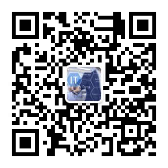

# k8s-edge-knowlege

本人云原生之旅，涉及 Kubernetes、容器、微服务、Service Mesh 服务网格、Go、Java、源码分享与学习、资料共享等。

## 微信公众号

## kubernetes

[极客时间张磊 Kubernetes 课程学习笔记](Kubernetes/K8s-Learn.md)

[Kubernetes ckad 考试 Demo](Kubernetes/ckad/ckad.md)

## 存储

## 网络

## istio 服务网格

[istio 使用 thrift 协议案例](istio/istio-thrift-example/README.md)

[使用 wasm c++ filter 拓展 envoy](istio/wasm-extend-envoy/readme.md)

[Istio 服务网格如何处理安全问题](istio/security/istio-security.md)

[istio 集群服务与 VM (虚拟机)服务进行 Mesh 通信](istio/vm/istio-cluster-vm-example.md)

[istio TCP 测试用例](istio/example/tcp-demo/src/java/readme.md)

[istio 测试案例 demo](istio/example/readme.md)

## ebpf

可参考 [ebpf](ebpf)

## istio 国产化适配

istio 适配 arm、ppc 等架构，可参考 https://github.com/querycap/istio。

## 算法

算法与设计，可参考 [算法题](interview/readme.md)

## 为什么系列？

## 常见使用工具

记录了常见的使用命令与工具，可参见 [tools命令工具](tools/readme.md)
