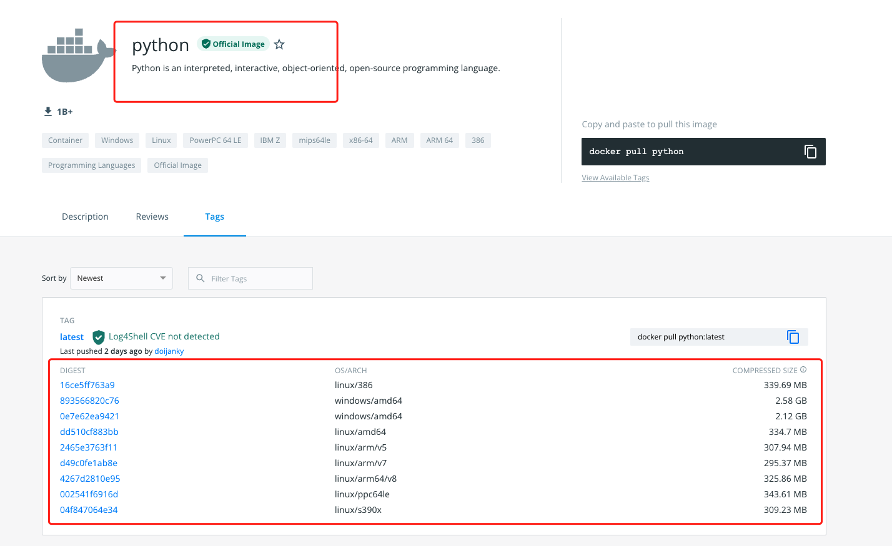
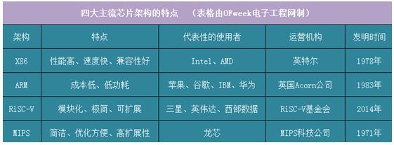
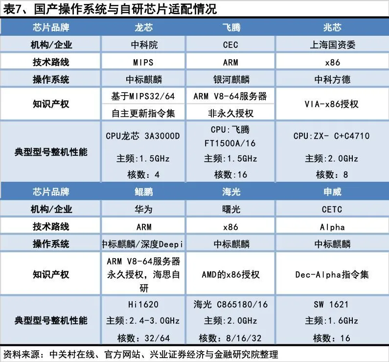
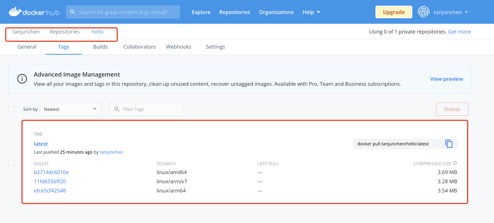
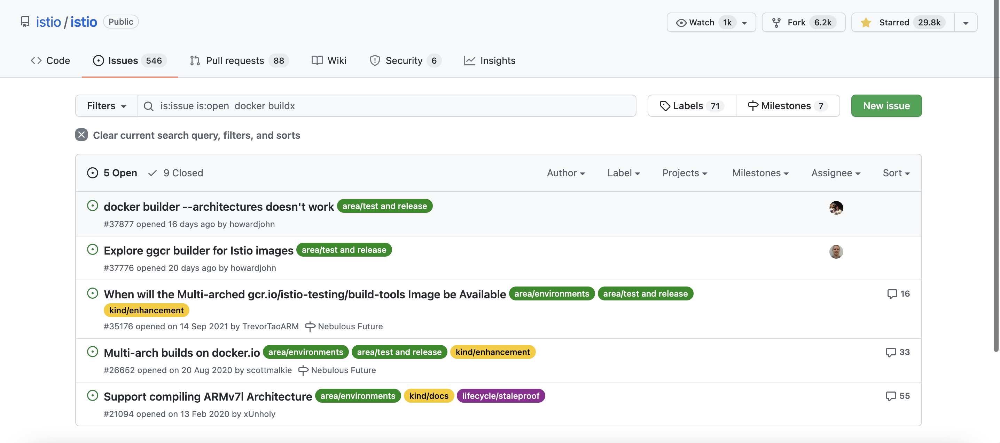
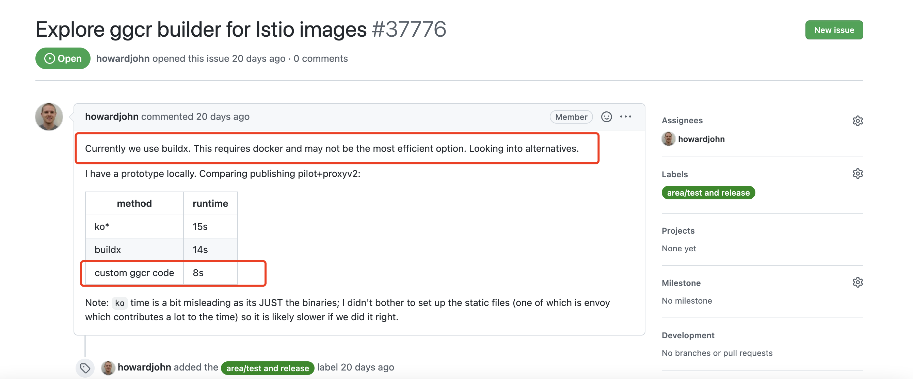

# 如何构建多架构多平台 Docker 镜像？

## 前言

在不同操作系统和处理器架构上运行应用是很普遍的需求，因此为不同平台单独构建发布版本是一种常见做法。

当我们用来开发应用的平台与部署的目标平台不同时，实现这一目标并不简单。

例如在 x86 架构上开发一个应用程序并将其部署到 ARM 平台的机器上，通常需要准备 ARM 平台的基础设施用于开发和编译。

在工作和生活中，我们可能经常需要将某个程序跑在不同的 CPU 架构上，比如让某些不可描述的软件运行在树莓派或嵌入式路由器设备上。

但是想要跨平台构建 Docker 镜像可不是一件轻松的活，要么到不同 CPU 架构的系统上全部构建一遍，

要么就得在当前系统上通过虚拟化技术模拟不同的 CPU 架构，最后可能还要想办法合并镜像，费力不讨好。


不过值得庆幸的是，Docker 19.03  引入了一个新的实验性插件，docker buildx 该插件使得跨平台构建 Docker 镜像比以往更加容易。

一次构建多处部署的镜像分发大幅提高了应用的交付效率，对于需要跨平台部署应用的场景，

利用 docker buildx 构建跨平台的镜像也是一种快捷高效的解决方案。

## 前提

### 说明

大部分镜像托管平台支持多平台镜像，这意味着镜像仓库中单个标签可以包含不同平台的多个镜像，

以 docker hub 的 python 镜像仓库为例，tag 标签就包含了 10 个不同系统和架构的镜像（平台 = 系统 + 架构）



### CPU

我们来简单看下以下的常见的四大主流芯片架构：



ARM和X86架构最显著的差别是使用的指令集(复杂指令集)不同，RiSC-V架构与MIPS架构是一种采取精简指令集（RISC）的处理器架构。

### 国产化



## 途径

先简单介绍下当前跨 CPU 架构编译程序的不同方法。

### 方式1 - 直接在目标硬件上编译

如果我们可以访问目标架构硬件，同时该操作系统支持运行构建所需的各种工具，那么就可以直接在硬件上编译应用程序。

### 方式2 - 模拟目标硬件

还记得我们年少时在各种网吧、台球室之类的场合玩的街机游戏吗？


我们可以使用模拟器去体验回味下以前玩街机游戏了，比如常见的模拟器 Emulator。借助模拟器，我们可以时光倒流。

当然，我们也可以使用开源的 QEMU 模拟器，QEMU 支持许多常见的 CPU 架构，包括 ARM、Power-PC 和 RISC-V 等。

通过模拟一个完整的操作系统，可以创建通用的 ARM 虚拟机，该虚拟机可以引导 Linux，设置开发环境，也可以在虚拟机内编译程序。

【QEMU-百度百科】

QEMU是一套由法布里斯·贝拉(Fabrice Bellard)所编写的以GPL许可证分发源码的模拟处理器软件，在GNU/Linux平台上使用广泛。

Bochs，PearPC等与其类似，但不具备其许多特性，比如高速度及跨平台的特性，通过KQEMU这个闭源的加速器，QEMU能模拟至接近真实电脑的速度。

【qemu-github地址】

https://github.com/qemu/qemu

【chroot 地址】

https://en.wikipedia.org/wiki/Chroot

### 方式3 - 模拟目标硬件的用户空间

在 Linux 系统上，QEMU 有另外一种操作模式，可以通过用户模式模拟器来运行非本地架构的二进制程序。

该模式下，QEMU 会跳过方法 2 中描述的对整个目标系统硬件的模拟，取而代之的是通过 binfmt_misc 在 Linux 内核注册一个二进制格式处理程序，

将陌生二进制代码拦截并转换后再执行，同时将系统调用按需从目标系统转换成当前系统。

最终对于用户来说，他们会发现可以在本机运行这些异构二进制程序。

通过 QEMU 的用户态模式，我们可以创建轻量级的虚拟机（chroot 或容器），然后在虚拟机系统中编译程序，和本地编译一样简单轻松。

后面我们就会看到，跨平台构建 Docker 镜像用的就是这个方法。

### 方法4 - 使用交叉编译器

最后，还有一种在嵌入式系统社区标准的做法：交叉编译。

交叉编译器是专门为在给定的系统平台上运行而设计的编译器，但是可以编译出另一个系统平台的可执行文件。

例如，amd64 架构的 Linux 系统上的 C++ 交叉编译器可以编译出运行在 aarch64(64-bit ARM)  架构的嵌入式设备上的可执行文件。安卓设备的 APP 基本上都是通过这种方法来编译的。

从性能角度来看，该方法与方法 1 没什么区别，因为不需要模拟器的参与，几乎没有性能损耗。

但交叉编译不具有通用性，它的复杂度取决于程序使用的语言。如果使用 Golang 的话，那就超级简单。

在云原生容器时代，我们讨论构建时不仅包括构建单个可执行文件，还包括构建容器镜像。

而且构建容器镜像比上面说的方法更复杂，再加上 Docker 本身的复杂性，这是一个很复杂的问题。

为了能够更方便的构建多架构 Docker 镜像，我们可以使用最近发布的 Docker 扩展：buildx。

buildx 是下一代标准 docker build 命令的前端，既我们熟悉的用于构建 Docker 镜像的命令。

通过借助 BuildKit ，buildx 扩展了表中 docker build 命令的功能，成为 Docker 构建系统的新后端。

## 案例

要想使用 buildx，首先要确保 Docker 版本不低于 19.03，同时还要通过设置环境变量 DOCKER_CLI_EXPERIMENTAL 来启用。

可以通过下面的命令来为当前终端启用 buildx 插件：

### 启动 buildx 插件

```
➜  ~ export DOCKER_CLI_EXPERIMENTAL=enabled
➜  ~ docker buildx version
github.com/docker/buildx v0.5.1-docker 11057da37336192bfc57d81e02359ba7ba848e4a
```

### 启用 binfmt_misc 来运行非本地架构 Docker 镜像

如果我们使用的是 Mac 或者 Windows 版本 Docker 桌面版，可以跳过这个步骤，因为 binfmt_misc 默认开启。

如果使用是 Linux 系统，需要设置 binfmt_misc。

在大部分发行版中，这个操作非常简单，但是现在可以通过运行一个特权 Docker 容器来更方便的设置。

```
$ docker run --rm --privileged docker/binfmt:66f9012c56a8316f9244ffd7622d7c21c1f6f28d
```

通过检查 QEMU 处理程序来验证 binfmt_misc 设置是否正确：

```
ls -al /proc/sys/fs/binfmt_misc/
```

然后，验证下指定架构处理程序已经启用
```
cat /proc/sys/fs/binfmt_misc/qemu-aarch64
```

### 将默认 Docker 镜像构建器切换成多架构构建器

运行以下命令，创建一个新的支持多架构的构建器。

```
# 新建构建器
docker buildx create --use --name mybuilder
# 启动构建器
docker buildx inspect mybuilder --bootstrap
```

验证新的构建器

```
➜  ~ docker buildx ls
NAME/NODE        DRIVER/ENDPOINT             STATUS   PLATFORMS
m1_builder       docker-container
  m1_builder0    unix:///var/run/docker.sock inactive
multi-builder    docker-container
  multi-builder0 unix:///var/run/docker.sock stopped  linux/arm64*, linux/amd64*
mybuilder *      docker-container
  mybuilder0     unix:///var/run/docker.sock inactive
desktop-linux    docker
  desktop-linux  desktop-linux               running  linux/arm64, linux/amd64, linux/riscv64, linux/ppc64le, linux/s390x, linux/386, linux/arm/v7, linux/arm/v6
default          docker
  default        default                     running  linux/arm64, linux/amd64, linux/riscv64, linux/ppc64le, linux/s390x, linux/386, linux/arm/v7, linux/arm/v6
```

### 构建多架构 Docker 镜像

现在我们就可以构建支持多 CPU 架构的镜像：

```
go 代码
cat hello.go
package main
 
import (
        "fmt"
        "runtime"
)
 
func main() {
        fmt.Printf("Hello, %s!\n", runtime.GOARCH)
}
```


创建一个 Dockerfile 将该应用容器化：
```
cat Dockerfile
FROM golang:alpine AS builder
RUN mkdir /app
ADD . /app/
WORKDIR /app
RUN go build -o hello .
 
FROM alpine
RUN mkdir /app
WORKDIR /app
COPY --from=builder /app/hello .
CMD ["./hello"]
```

这是一个多阶段构建 Dockerfile，使用 Go 编译器来构建应用，并将构建好的二进制文件拷贝到 alpine 镜像中。

现在就可以使用 buildx 构建一个支持 arm、arm64 和 amd64 多架构的 Docker 镜像。

```
docker buildx build -t tanjunchen/hello --platform=linux/arm,linux/arm64,linux/amd64 . --push
 
[+] Building 15.9s (37/37) FINISHED
 => [internal] load build definition from Dockerfile                                                                                      0.0s
 => => transferring dockerfile: 223B                                                                                                      0.0s
 => [internal] load .dockerignore                                                                                                         0.0s
 => => transferring context: 2B                                                                                                           0.0s
 => [linux/amd64 internal] load metadata for docker.io/library/alpine:latest                                                              1.1s
 => [linux/amd64 internal] load metadata for docker.io/library/golang:alpine                                                              1.1s
 => [linux/arm/v7 internal] load metadata for docker.io/library/golang:alpine                                                             1.0s
 => [linux/arm/v7 internal] load metadata for docker.io/library/alpine:latest                                                             1.0s
 => [linux/arm64 internal] load metadata for docker.io/library/alpine:latest                                                              1.0s
 => [linux/arm64 internal] load metadata for docker.io/library/golang:alpine                                                              1.0s
 => [linux/arm/v7 stage-1 1/4] FROM docker.io/library/alpine@sha256:ceeae2849a425ef1a7e591d8288f1a58cdf1f4e8d9da7510e29ea829e61cf512      0.0s
 => => resolve docker.io/library/alpine@sha256:ceeae2849a425ef1a7e591d8288f1a58cdf1f4e8d9da7510e29ea829e61cf512                           0.0s
 => [internal] load build context                                                                                                         0.0s
 => => transferring context: 110B                                                                                                         0.0s
 => [linux/arm/v7 builder 1/5] FROM docker.io/library/golang:alpine@sha256:6fd04df1b7ba6253a09b4bd3f37cc1fb69903a60209ef959485328b1c2902  0.0s
 => => resolve docker.io/library/golang:alpine@sha256:6fd04df1b7ba6253a09b4bd3f37cc1fb69903a60209ef959485328b1c2902327                    0.0s
 => [linux/amd64 stage-1 1/4] FROM docker.io/library/alpine@sha256:ceeae2849a425ef1a7e591d8288f1a58cdf1f4e8d9da7510e29ea829e61cf512       0.0s
 => => resolve docker.io/library/alpine@sha256:ceeae2849a425ef1a7e591d8288f1a58cdf1f4e8d9da7510e29ea829e61cf512                           0.0s
 => [linux/amd64 builder 1/5] FROM docker.io/library/golang:alpine@sha256:6fd04df1b7ba6253a09b4bd3f37cc1fb69903a60209ef959485328b1c29023  0.0s
 => => resolve docker.io/library/golang:alpine@sha256:6fd04df1b7ba6253a09b4bd3f37cc1fb69903a60209ef959485328b1c2902327                    0.0s
 => [linux/arm64 builder 1/5] FROM docker.io/library/golang:alpine@sha256:6fd04df1b7ba6253a09b4bd3f37cc1fb69903a60209ef959485328b1c29023  0.0s
 => => resolve docker.io/library/golang:alpine@sha256:6fd04df1b7ba6253a09b4bd3f37cc1fb69903a60209ef959485328b1c2902327                    0.0s
 => [linux/arm64 stage-1 1/4] FROM docker.io/library/alpine@sha256:ceeae2849a425ef1a7e591d8288f1a58cdf1f4e8d9da7510e29ea829e61cf512       0.0s
 => => resolve docker.io/library/alpine@sha256:ceeae2849a425ef1a7e591d8288f1a58cdf1f4e8d9da7510e29ea829e61cf512                           0.0s
 => CACHED [linux/arm64 stage-1 2/4] RUN mkdir /app                                                                                       0.0s
 => CACHED [linux/arm64 stage-1 3/4] WORKDIR /app                                                                                         0.0s
 => CACHED [linux/arm64 builder 2/5] RUN mkdir /app                                                                                       0.0s
 => CACHED [linux/arm64 builder 3/5] ADD . /app/                                                                                          0.0s
 => CACHED [linux/arm64 builder 4/5] WORKDIR /app                                                                                         0.0s
 => CACHED [linux/arm64 builder 5/5] RUN go build -o hello .                                                                              0.0s
 => CACHED [linux/arm64 stage-1 4/4] COPY --from=builder /app/hello .                                                                     0.0s
 => CACHED [linux/amd64 stage-1 2/4] RUN mkdir /app                                                                                       0.0s
 => CACHED [linux/amd64 stage-1 3/4] WORKDIR /app                                                                                         0.0s
 => CACHED [linux/amd64 builder 2/5] RUN mkdir /app                                                                                       0.0s
 => CACHED [linux/amd64 builder 3/5] ADD . /app/                                                                                          0.0s
 => CACHED [linux/amd64 builder 4/5] WORKDIR /app                                                                                         0.0s
 => CACHED [linux/amd64 builder 5/5] RUN go build -o hello .                                                                              0.0s
 => CACHED [linux/amd64 stage-1 4/4] COPY --from=builder /app/hello .                                                                     0.0s
 => CACHED [linux/arm/v7 stage-1 2/4] RUN mkdir /app                                                                                      0.0s
 => CACHED [linux/arm/v7 stage-1 3/4] WORKDIR /app                                                                                        0.0s
 => CACHED [linux/arm/v7 builder 2/5] RUN mkdir /app                                                                                      0.0s
 => CACHED [linux/arm/v7 builder 3/5] ADD . /app/                                                                                         0.0s
 => CACHED [linux/arm/v7 builder 4/5] WORKDIR /app                                                                                        0.0s
 => CACHED [linux/arm/v7 builder 5/5] RUN go build -o hello .                                                                             0.0s
 => CACHED [linux/arm/v7 stage-1 4/4] COPY --from=builder /app/hello .                                                                    0.0s
 => exporting to image                                                                                                                   14.1s
 => => exporting layers                                                                                                                   0.0s
 => => exporting manifest sha256:11fd6556ff209e6fdb46a7344228dbc02c677a15f4d9399bd8fa2870dba82c33                                         0.0s
 => => exporting config sha256:7bd1059c7a1ed2dae93fee549cc7b79656abf4827f2ff32d7c7e2b361175a702                                           0.0s
 => => exporting manifest sha256:efce5cf42548ebf338e5132f66c8568abb151ed1595c448bdf079ac991bd8222                                         0.0s
 => => exporting config sha256:61be9e2404bb37bdbcacb3f2c874c02458f65e11a85f4975cb17b18e46fa9b71                                           0.0s
 => => exporting manifest sha256:b27144c6016e93817bf9c7019d697fca7ea04c2cbdf3ec4948d6778b4f033a99                                         0.0s
 => => exporting config sha256:58b110e4e4a36bb76b934cad8fa968cc00cc51c439b2bd47078d3de2c6f94786                                           0.0s
 => => exporting manifest list sha256:d8a65abdf1bd1e70b410c56a3e418869860e116e1c69a7d2dfa67fe978d85fea                                    0.0s
 => => pushing layers                                                                                                                    12.2s
 => => pushing manifest for docker.io/tanjunchen/hello:latest@sha256:d8a65abdf1bd1e70b410c56a3e418869860e116e1c69a7d2dfa67fe978d85fea     1.9s
```

现在就可以通过 docker pull tanjunchen/hello 拉取刚刚创建的镜像，Docker 将会根据你的 CPU 架构拉取匹配的镜像。

### 原理

buildx 会通过 QEMU 和 binfmt_misc  分别为 3 个不同的 CPU 架构（arm，arm64 和 amd64）构建 3 个不同的镜像。

构建完成后，就会创建一个 docker manifest list，其中包含了指向这 3 个镜像的指针。

列出每个镜像的 digests：

```
docker buildx imagetools inspect tanjunchen/hello

community docker buildx imagetools inspect tanjunchen/hello
 
Name:      docker.io/tanjunchen/hello:latest
MediaType: application/vnd.docker.distribution.manifest.list.v2+json
Digest:    sha256:d8a65abdf1bd1e70b410c56a3e418869860e116e1c69a7d2dfa67fe978d85fea
 
Manifests:
  Name:      docker.io/tanjunchen/hello:latest@sha256:11fd6556ff209e6fdb46a7344228dbc02c677a15f4d9399bd8fa2870dba82c33
  MediaType: application/vnd.docker.distribution.manifest.v2+json
  Platform:  linux/arm/v7
 
  Name:      docker.io/tanjunchen/hello:latest@sha256:efce5cf42548ebf338e5132f66c8568abb151ed1595c448bdf079ac991bd8222
  MediaType: application/vnd.docker.distribution.manifest.v2+json
  Platform:  linux/arm64
 
  Name:      docker.io/tanjunchen/hello:latest@sha256:b27144c6016e93817bf9c7019d697fca7ea04c2cbdf3ec4948d6778b4f033a99
  MediaType: application/vnd.docker.distribution.manifest.v2+json
  Platform:  linux/amd64
```

#### binfmt_misc

binfmt_misc (Miscellaneous Binary Format)是 Linux 内核从很早开始就引入的机制，可以通过要打开文件的特性来选择到底使用哪个程序来打开它，

不光可以通过文件的扩展名来判断的，还可以通过文件开始位置的特殊的字节（Magic Byte）来判断。

docker buildx 简单来说是通过注册一个“解释器”和一个文件识别方式，以达到运行文件的时候调用自定义解释器的目的。

#### Docker Manifests

```
FROM golang:alpine AS builder
```

相信大家在编写 Dockerfile 的时候会经常这么用，正常来说，这么写的镜像都是从 docker hub 拉取的镜像，

docker hub 上的镜像支持 docker 的 manifests 特性，简单来说就是一个镜像地址，当我们 docker pull 的时候，

它会根据当前机器体系架构来拉取对应于这个体系架构的镜像，比如你是x86的，则给你拉取的是x86的镜像，

是arm64的机器拉取的则是arm64的，原理就在于每个镜像都维护着一个manifest(清单),这个清单上记录着每个体系架构对应用镜像层，

在docker pull的时候，docker这时做为一个client端，与docker hub的服务端通信的时候，会先看这个镜像存不存在manifests，

如果存在则拉取匹配当前机器体系架构的镜像，如果不存在，则就直接拉取。

我们查看 hello 的 manifest 清单列表。



### Istio 社区






https://github.com/GoogleCloudPlatform/cloud-builders

## 总结

回顾一下，本文带大家了解在不同的 CPU 架构上运行软件的挑战性，以及 buildx 如何帮助我们解决其中的一些挑战。

使用 buildx，我们无需对 Dockerfile 进行任何修改，就可以创建支持多种 CPU 架构的 Docker 镜像。

任何安装了 Docker 的系统都可以拉取到与它的 CPU 架构相匹配的镜像。

## 参考

1、https://docs.docker.com/buildx/working-with-buildx/#build-with-buildx

2、https://docs.docker.com/engine/reference/commandline/buildx_build/#output

3、https://docs.docker.com/desktop/multi-arch/

4、https://github.com/istio/istio/issues?q=is%3Aissue+is%3Aopen++docker+buildx

5、https://github.com/istio/istio/issues/37776